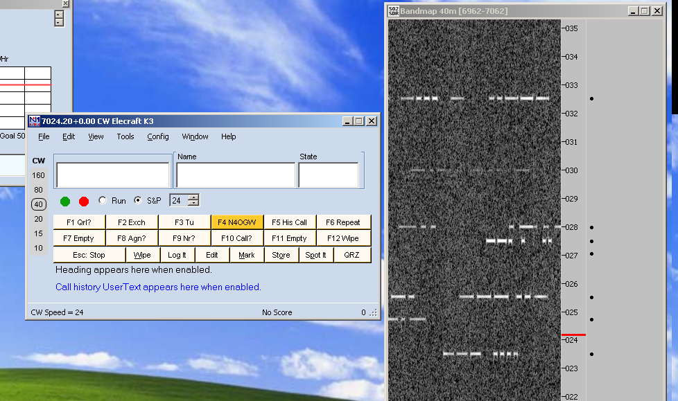

## So2sdr
------------

A ham radio contest log program that features a software-defined radio (SDR) 
bandscope.  The main ideas behind the program are described in an article
in May/June 2013 National Contest Journal [NCJ](http://ncjweb.com).
The program is primarily developed for Linux use, but can also
be compiled for Windows. 

### Features

* Two-radio (SO2R) support. Headphone and radio switching via parallel port 
or [OTRSP](http://www.k1xm.org/OTRSP/) (Open two-radio switching protocol)
USB devices

* Uses [hamlib](http://sourceforge.net/projects/hamlib/)  to control radios via serial port

* Supports soundcard based I/Q SDRs and some ethernet interface SDRs.
This include the [Softrock](http://fivedash.com/) series,
[LP-PAN](http://www.telepostinc.com/LP-PAN.html), and
the [Afedri](http://www.afedri-sdr.com/) SDR, including the dual-receiver Afedri
AFE822x SDR-Net.

* Uses [Winkey](http://k1el.tripod.com/WhatisWK.html) for CW generation

### Limitations

* So2sdr is primarily designed for unassisted operating (it
can connect to telnet dxclusters however).

* SSB support is quite limited at the moment and there is
currently no support for digital modes.

* The number of different contests supported is small so far.

### Screenshots

#### Main Window 

* Sosdr tries to present all basic information you need
in one window so the user doesn't have to search multiple
open windows: two radio interfaces, multiplier information, previous
call information, etc.

#### SDR bandmap

* A unique feature of So2sdr is color highlighting of actual signals
on the bandmap. This can be used to rapidly identify new stations to
work without tuning through the entire band. 
Below dupes are highlighted in pink and unknown signals in white.
White signals are much more likely to be stations you haven't
worked before. Clicking on the bandmap tunes the radio.

* Note that despite some similarity to the display of CW Skimmer,
So2sdr does not decode CW. That is up to the operator.

* So2sdr can also search the bandmap for the frequencies with no
signals. This is a fast way to find a run frequency on a crowded
band.

#### So2sdr-bandmap with N1MM+

As of version 2.0.0, the bandmap part of so2sdr can be used as a stand-alone
executable. It can read the frequency from N1MM+ logger, but more advanced
functions are not yet supported.

