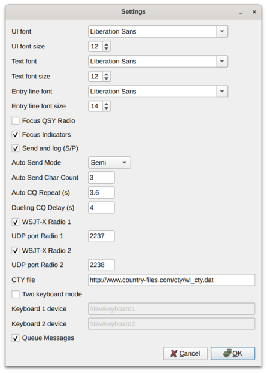

<a name="top"></a>
## SO2SDR Help file version 2.0.1

* [Overview](#overview)
* [Installation](#install)
* [Setup: so2sdr](#so2sdr_setup)
* [Setup: So2sdr-bandmap setup](#bandmap_setup)
* [Changelog](#changes)

---

<a name="overview"></a>
### Overview

So2sdr  consists of two separate executables:

1. so2sdr: this is the executable for the logging program
2. so2sdr-bandmap: this is the executable for the SDR bandmap

The two can be used separately from each other. For example, so2sdr
can be used for logging a contest without using the visual SDR
bandmap. The bandmap can also be used without so2sdr to display a
bandmap for general operating or used with a separate logging
program. When used together, so2sdr can control the execution of
so2sdr-bandmap, or so2sdr-bandmap can be started separately by
the user.

Note that older versions of so2sdr combined the two in a single
program. From version 2.0.0 they have been separated. The separation provides
better performance for the bandmap and allows it to be used in a
number of new ways.

If you are going to use the SDR bandmap, you need to configure this
first before so2sdr.  The first time either program is run it will
create a directory to store user settings. The default location is
~/.so2sdr (Linux) or C:/Documents and Settings/Username/so2sdr
(Windows). In this directory, the default configuration file for
so2sdr is so2sdr.ini, and the default configuration file for
so2sdr-bandmap is so2sdr-bandmap.ini. If you are using two copies
of the bandmap for SO2R, you will need to make two separate
copies of so2sdr-bandmap.ini (see below).

 [Return to top](#top)

---

<a name="install"></a>
### Installing So2sdr

#### Linux

You will need the following development libraries installed: Qt4, FFTW, Hamlib, and PortAudio. Other various development packages include g++, Git, and pkg-config. 


1. Clone the git repository to your local machine:
    
        git clone git://github.com/n4ogw/so2sdr.git

2. By default, so2sdr will be installed in /usr/local/bin, and associated
  data files will be placed in /usr/local/share/so2sdr. If you want to
  change the location of the program, edit SO2SDR_INSTALL_DIR in common.pri

3. In the directory so2sdr, 

    ```
    qmake
    make
    ```

    ``make -j 2``  will use 2 cores and go faster.
    Subdirectory Makefiles are created from the top level Makefile.

5. (as superuser) 
         
        make install
 
6. Test and contribute!


#### Windows

There are two Windows installer packages (32 bit):

1. So2sdr-x.x.x.exe : contains the
logging program and SDR bandmap

2. so2sdr-bandmap-x.x.x.exe : contains only the SDR bandmap
(for use standalone or with other logging programs).

 To remove, run "uninstall" in the installation directory, or delete
the install directory.  The program does not make any registry
changes.

#### Windows Issues 

The GNU mingw compiler has some issues building for Windows. While the
program is linked as "static", it still depends on several MS Windows
DLL's, including msvcrt.dll. This DLL changes with the version of
Windows. In some cases the program may not run on older versions of
Windows (XP) because it is missing some dependency in msvcrt.dll.

 [Return to top](#top)

---

<a name="so2sdr_setup"></a>
### So2sdr setup

In so2sdr there are two types of configuration:


1. Station settings : These are settings that
do not generally change between different contests. These
include station hardware,
location, etc. Under "Config", this includes
Station, General Settings, Radios/SO2R, Winkey, and Bandmap.
Station settings are loaded as soon
as the program is run. These settings are stored 
in the so2sdr.ini file in the main configuration
directory for so2sdr.

2. Contest settings : These are settings specific to each
contest. They are only loaded once a contest has been loaded from the
File menu. They are stored in .cfg files specific to each
contest. Most people would keep these in a different directory that
~/.so2sr, for example organized by year.  Note that in order to load a
different contest you must exit and restart so2sdr.

---

#### Station data


The station dialog should be filled out the first time the
program is started. It contains information
that usually does not change for different contests; this is
stored in the "so2sdr.ini" file in the user's directory. The
ini file is ASCII and can be edited by hand; be careful
making changes this way however.


* The grid square should be 4 characters and
is used to determine beam headings from your qth and the sunrise/sunset
times for your qth. These will be updated once you have loaded
a contest. Hint: if you enter your own call in the callsign
entry window, the precise sunrise and sunset for your
QTH will be shown.
* Name, zones, state, and ARRL section are used
to fill out default exchanges in various contests.


---

#### Settings Dialog

This dialog contains various settings that affect program
behavior.




* Focus QSY Radio : switch audio focus to the second
radio while the other radio is sending.
* Audio and Transmit Focus Indicators : small "LED"
indicators that show the state of RX and TX focus.
* Send exchange and log (S/P) : In Search and Pounce
mode, if this setting is checked, the QSO will be immediately
logged after sending the exchange with the second Enter press.
If unchecked, an extra Enter is required after sending
the exchange to log the qso.
* Auto Send Mode : When running stations, if set to 
"Auto", the program will automatically begin sending
 the callsign entered and exchange once a certain number
of characters have been entered.
* Auto Send "Auto" Character Count : if using
Auto mode above, start sending when this number of
characters have been entered.
* Dueling CQ Delay : Dueling CQ between the two
radios is activated with Crtl- (Control Minus). This setting
adds an extra delay before switching radios.

---

#### Radio and SO2R switching setup


* Radio control uses the Hamlib library. The current version
being used is shown at the top. 
* Tabs 1 and 2 are for the two radios. The "Dummy" model
can be used for testing when no radio is attached. Note that
the PTT method setting is not currently used.

* Under Linux
serial ports are typically /dev/ttyS0, /dev/ttyS1, /dev/ttyUSB0, etc.
You may have to add your username to a particular group to access
these ports. Under Windows ports are COM1, COM2, ...
* When the radios are configured correctly, after
clicking "OK" in the radio dialog the "R1" and "R2"
indicators at the bottom of the main window
should say "ON" and turn black. Red here indicates a problem.

* Three different methods are supported for switch audio
and keying between the two radios:
    1. OTRSP : Open Two Radio Switching Protocol. This supports
     USB-connected two-radio switches like the SO2RDuino box.
    2. Parallel port : This option toggles pins on the
     parallel port. To use this in Linux, you need the PPDEV
     kernel option, and your user name must be in the
     correct group (usuall "lp") to access the port.
    3. microHam : The microHam series of SO2R switches.

---

#### Winkey

The only method supported to send CW currently
is via the Winkey chip. Winkey emulation
in a microHam box can also be used.


* CW Output : if unchecked, no CW will be outputed.
* Paddle sidetone : enables winkey sidetone only
when sending with the paddle.
* Swap : swaps dit/dah paddle connections.
* CT space : uses slightly reduced spaces between words.
* After clicking OK, the "WK" indicator at the bottom
of the main window should say "ON" and turn black. Red 
here indicates a problem.
* Iambic A/Iambic B/Ultimatic/Bug : choose paddle mode.

---

#### Bandscope settings

A unique feature of SO2SDR is the SDR bandmap integrated with the
logging program. The Bandscope setup dialog is
described below. Note that version 2 introduced significant changes,
as the bandmap is run as a separate process, communicating with
so2sdr via TCP and UDP.


* UDP port: this must match the UDP broadcast port defined in so2sdr-bandmap
* Spot timeout : the length of time callsigns are displayed
on the bandmap. Callsigns are either entered by the 
operator or can be read from the telnet interface to
a dx spotting network.
* Change radios on click : if this setting is
enabled, clicking on a signal in either bandmap
will change the active radio and QSY to this frequency.
This can be used to search and pounce visually
across two separate bands.
* CQ Finder: one function of the bandscope is to 
find unused frequencies in order to call CQ. The program
records the location of all signals within a certain
time (integration time) and looks for the largest
open space between signals. This frequency
can be set using the BEST_CQ macro (see CW macros in Reference).
Settings controlling the CQ finder:
    2. Frequency limits : the program searches for 
     open frequencies on each band between these limits.
     Note that the bandscope itself only covers 96 KHz
      and therefore may not cover the entire band in
      question. In this case, the limit will be change to
     reflect the frequency range actually 
     covered by the bandscope.

When  operating with the bandmap, you should enable "Grab
keyboard" from the "Windows" menu, which will prevent the call
and exchange entry lines from losing keyboard focus.

---

#### Contest Settings

Starting a new contest: see File menu.


* Start a new contest from the file menu. After choosing where to
save it, you can customize CW Messages and Contest Options.
If you have already operated this contest before, just make 
a copy of the ".cfg" file. This way you will not need to
reconfigure CW macros and other settings again.
* The list of contests known by so2sdr is in the "contest_list.dat"
file (in /usr/local/share/so2sdr/ under Linux, and in the
same directory as the executable under Windows). Each line of 
this file is of the format Displayed name, config file.
* Note that in some cases new contests can be easily added added to
this list if they have rules that are similar to existing
contests. You can create new contest by modifying an already existing
base config file. For example, both the NCCC Sprint and North American
Sprint use the built-in "SPRINT" rules, the only difference is in the
base config file (ns.cfg versus nasprint.cfg). The base config
file can for example then link to a different multiplier file.

---

#### CW Macros


* Separate messages can be programmed
for the F1-F12 keys in CQ and S&P modes, as well as Ctrl and Shift modified
function keys. 
* There are a number of special macros available, all of the form
{COMMAND}. In most cases I have set up a set of function
keys that works for my operating, although you might need
to adjust the exchange. Some special considerations:

    * CQ Func F1: this will be sent in CQ mode when pressing enter
    * Exc Func F1: this should be your callsign ({CALL})
    * Exc Func F2: this should be the contest exchange
    * Other: several special messages for exchange sent while CQing,
        etc.
* See full list of available <a href="#cw">CW/SSB macros</a>.

---

#### Contest options


Most of these settings are set by default by the rules
of the contest  chosen. Be careful changing them.

* Mults by band: if checked, mults count on each band. 
* Multimode : enable working multiple modes (not fully 
implemented)
* Show mode : show the mode of each qso in the onscreen log.
* Show mults: show multipliers in the large "Mults" box. In some
case this is not wanted, for example when there are a large number
of multipliers (CQ WPX for example).
* Sprint mode: special program logic for the NA Sprint.
* Supercheck partial: checking enables the
display of possible callsigns from the supercheck partial
database (http://ww.supercheckpartial.com). These files should
be placed in the program data directory (/usr/local/share/so2sdr under
Linux).
* Call history : if this is enabled, so2sdr will display
contest exchanges saved in a history database file. This file
is a SQLITE database file and can be edited/examined using a
number of programs (I use sqlitebrowser).
* Append Call history : append exchange history information
to the database file as qso's are logged. You can also import
them after a contest using the option under the File menu.
* Dupe behavior: three possible settings depending on
how strict you want to be with allowing dupes.
* Sent exchange: this will go in the Cabrillo file as the
send exchange columns. Note that
these entry boxes do not currently use the same macro system
used by the CW Messages, so entering {STATE} for example will
not work. Use "#" for a sent serial number.
* Off times : check this to enable automatic calculation 
of off time. You must fill in the start and end time/date
of the contest for this to work correctly.

[Return to top](#top)

---

<a name="bandmap_setup"></a>
### So2sdr-bandmap setup

#### Typical hardware setup

So2sdr-bandmap provides a "visual bandmap" that shows the activity on
the band for nearby frequencies. To use it you will need a SDR
receiver connected to the IF of your contesting radio. With this type
of setup, the SDR front end is automatically protected from
transmitted RF and gains the benefit of the main radio's front end
tuned circuits. There is also no need to tune the SDR frequency as the
radio is tuned; the SDR stays tuned at the IF frequency of the host
radio.

So2sdr-bandmap has been tested with the following SDR hardware:

* Softrock SDR receiver
* LP-PAN
* Afedri SDR, interfaced both via USB as a sound card, and via
ethernet.

Other SDR's may work if they supply an I/Q stream over the sound card interface
or via ethernet with the SDR-IP protocol. The program has been tested most with the
Elecraft K3.

**Important for SO2R:** For SO2R usage, you need to provide two different
configurations for so2sdr-bandmap, with different bandmap ID numbers (see below).
Test each radio's bandmap separately, and then copy the .ini file so2sdr-bandmap.ini
to a separate copy for that bandmap, such as so2sdr-bandmap1.ini and so2sdr-bandmap2.ini.
So2sdr has a setting to use different so2sdr-bandmap.ini files for each radio.
You can also make a separate desktop shortcut to start the bandmap for each
radio, and so2sdr will detect when each has been started.

#### Bandmap controls


Controls from left to right:

* start button
* stop button
* setup button
* quit buton
* Mark signals: if checked, so2sdr-bandmap will peak-detect signals,
placing a dot by each detected signal. This can be used to automatically
tune the radio to the next signal or find the largest open space
between signals.
* Gain slider: this controls the gain of the peak-detect algorithm.
Typically it does not need to be adjusted often, although sometimes
with heavy QRN you may want to decrease the gain.  Moving the slider
to the right makes the algorithm #less# sensitive (like a
squelch control).
* Help

Other controls:

* Mouse:
    + Left clicking on the bandmap signals will tune the radio to
    this frequency.
	+ In the frequency scale: holding down the left mouse button and
    drag to  move
	 the center marker.
    + Right click brings up several options: an option to hide the
	upper toolbar; zoom (scale) setting; call delete function (if
	near a callsign); and IQ balance status dialog.

#### Setting up So2sdr-bandmap

When the program starts, click the "wrench" icon. The main setup dialog opens:


* Bandmap ID number corresponds to the radio number in so2sdr; 1 or 2.
* TCP port: this is the TCP port number used to control the bandmap. If running SO2R,
each needs a different port number.
* UDP broadcast port: So2sdr-bandmap sends broadcast messages to this UDP port
after mouse clicks and other evens. Two copies of the program can share the same UDP port.
* N1MM+ : if this option is selected, So2sdr-bandmap will listen for UDP broadcasts
from N1MM+ logger and use them to set the center frequency. Fill in the port number
below.
* SDR type: the type of SDR receiver. Click configure for further details.
* CQ Finder time (in seconds): the length of time the program waits to determine if
a frequency is "empty."  This should be set to roughly the length of a typical
qso in the contest being operated. With longer exchanges (like in the
ARRL Sweepstakes) a longer time should be used here. Typically you should use a
value less than 30 seconds.

#### Soundcard SDR setup


* Type: for Linux there is only one option, ALSA. In Windows there are several
different sound API's.
* Device: So2sdr-bandmap tries to test which available sound devices
will work with the program, and puts a checkmark next to these. This
check is not 100% effective however. Normally you want to use the line
input.
* Speed: controls the scroll speed of the bandmap.
* Sample Rate: for sound cards, 48, 96, and 192 KHz are supported.
* Bits: most sound cards support 24 bit sampling; very few will
support 32 bits.
* IF offset: this must be adjusted so that signals when zero beat
on the receiver appear centered on the red line (center of bandmap).
* Swap IQ: reverse I and Q channels. Try this if the spectrum is
inverted.
* IQ Correction: corrects for imbalance in the I and Q channels.
If I and Q are imbalanced, image signals will be present on the
display.
* Collect IQ correction data: so2sdr-bandmap will use strong signals
to measure and correct IQ balance.

#### SDR-IP (Network) SDR

This is a generic interface for network-based SDR's using the
SDR-IP protocol.


#### Afedri Net SDR

This is an interface for the Afedri SDR
using the network interface. Note that it can also be used via the
USB/Soundcard interface.


1. For single-receiver Afedri SDR: fill in IP address, TCP
and UDP ports. Set Multichannel to "Single", Channel to 1,
and fill in Freq. 1. Make sure that Broadcast is set to off.
In my testing, "swap IQ" needed to be checked. Note that
not all sample rates are supported by the Afedri hardware
(check documentation). If a sample rate is entered that is
not supported, the SDR will use the nearest available sample
rate, which will cause frequency inaccuracies in the bandmap
display.

2. Multi-channel Afedri SDR: so2sdr-bandmap also supports the
multi-channel Afedri SDR's. In this mode, a single unit can be used to
provide bandmaps for two radios. The broadcast option of the Afedri is
set so that two copies of so2sdr-bandmap can receive the SDR data.
One copy of so2sdr-bandmap should run as "Master" and one as "Slave".
The Master bandmap controls the frequency for both SDR receivers.
Start the Master bandmap first followed by the Slave.

    This mode is somewhat experimental. Sometimes the 2nd SDR receiver
    does not start; a workaround seems to be to stop the Master
    bandmap (square "stop" button) and then restart it again.

[Return to top](#top)

---

<a name="changes"></a>

## version 2.0.1

* update help file in so2sdr

## version 2.0.0

* add network interface SDRs and Afedri SDR
* some unfinished features removed for the moment (click filter and
  DVK setup)
* rewrite of SDR bandmap; it is now a separate executable and can
  be used with other programs (see Documentation for use with 
  N1MM).
* known problems:
    + control of Afedri SDRs is somewhat buggy for dual-receiver
    models (when using both receivers).

    + under some Linux distributions  so2sdr-bandmap may have trouble 
    accessing the sound card if Pulseaudio is in use. A workaround is to
    use the pasuspender utility to stop Pulseaudio while so2sdr is
    running. If starting the bandmap from so2sdr, do this

            pasuspender -- so2sdr
   
        or if running so2sdr-bandmap separately,

            pasuspender -- so2sdr-bandmap

## version 1.5.2

* fixed several bugs in the alt-D code. Some slight change in how alt-D
  works- now if the radio is changed (alt-R or ctrl-R), and alt-D call
  will be cleared, unless the alt-D qso is already in progress (exchange
  entered).
* fix qso and mult info being shown on wrong radio with alt-D
* Call window has call, ESC pressed; was not clearing the mult and
  worked information, entering S&P mode afterwards would show these for
  the last call even with no entered callsign.
* fixed bandmap TX status bug: changing radios while CW was sending
    would prevent TX icon from turning off. Now turns off TX also whenever
     CW is canceled.


## version 1.5.1

* Some minor bug fixes and code cleanup
* qextserialport code updated
* Build system revised, especially Windows build

[Return to top](#top)
