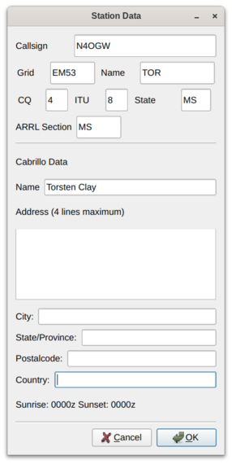

<a name="top"></a>
## SO2SDR Help file version 2.0.4

* [Overview](#overview)
* [Installation](#install)
* [Setup: so2sdr](#so2sdr_setup)
* [Setup: So2sdr-bandmap setup](#bandmap_setup)
* [Key Reference](#keyref)
* [Message macros](#macros)
* [Operating notes](#notes)
* [Known issues](#issues)
* [Changelog](#changes)

---

<a name="overview"></a>
### Overview

So2sdr  consists of two separate executables:

1. so2sdr: this is the executable for the logging program
2. so2sdr-bandmap: this is the executable for the SDR bandmap

The two can be used separately from each other. For example, so2sdr
can be used for logging a contest without using the visual SDR
bandmap. The bandmap can also be used without so2sdr to display a
bandmap for general operating or used with a separate logging
program. When used together, so2sdr can control the execution of
so2sdr-bandmap, or so2sdr-bandmap can be started separately by
the user.

Note that older versions of so2sdr combined the two in a single
program. From version 2.0.0 they have been separated. The separation provides
better performance for the bandmap and allows it to be used in a
number of new ways.

If you are going to use the SDR bandmap, you need to configure this
first before so2sdr.  The first time either program is run it will
create a directory to store user settings. The default location is
~/.so2sdr (Linux) or C:/Documents and Settings/Username/so2sdr
(Windows). In this directory, the default configuration file for
so2sdr is so2sdr.ini, and the default configuration file for
so2sdr-bandmap is so2sdr-bandmap.ini. If you are using two copies
of the bandmap for SO2R, you will need to make two separate
copies of so2sdr-bandmap.ini (see below).

 [Return to top](#top)

---

<a name="install"></a>
### Installing So2sdr

#### Linux

You will need the following development libraries installed: Qt4, FFTW, Hamlib, and PortAudio. Other various development packages include g++, Git, and pkg-config. 


1. Clone the git repository to your local machine:
    
        git clone git://github.com/n4ogw/so2sdr.git

2. By default, so2sdr will be installed in /usr/local/bin, and associated
  data files will be placed in /usr/local/share/so2sdr. If you want to
  change the location of the program, edit SO2SDR_INSTALL_DIR in common.pri

3. In the directory so2sdr, 

    ```
    qmake
    make
    ```

    ``make -j 2``  will use 2 cores and go faster.
    Subdirectory Makefiles are created from the top level Makefile.

5. (as superuser) 
         
        make install
 
6. Test and contribute!


#### Windows

There are two Windows installer packages (32 bit):

1. So2sdr-x.x.x.exe : contains the
logging program and SDR bandmap

2. so2sdr-bandmap-x.x.x.exe : contains only the SDR bandmap
(for use standalone or with other logging programs).

 To remove, run "uninstall" in the installation directory, or delete
the install directory.  The program does not make any registry
changes.

#### Windows Issues 

The GNU mingw compiler has some issues building for Windows. While the
program is linked as "static", it still depends on several MS Windows
DLL's, including msvcrt.dll. This DLL changes with the version of
Windows. In some cases the program may not run on older versions of
Windows (XP) because it is missing some dependency in msvcrt.dll.

 [Return to top](#top)

---

<a name="so2sdr_setup"></a>
### So2sdr setup

In so2sdr there are two types of configuration:


1. Station settings : These are settings that
do not generally change between different contests. These
include station hardware,
location, etc. Under "Config", this includes
Station, General Settings, Radios/SO2R, Winkey, and Bandmap.
Station settings are loaded as soon
as the program is run. These settings are stored 
in the so2sdr.ini file in the main configuration
directory for so2sdr.

2. Contest settings : These are settings specific to each
contest. They are only loaded once a contest has been loaded from the
File menu. They are stored in .cfg files specific to each
contest. Most people would keep these in a different directory that
~/.so2sr, for example organized by year.  Note that in order to load a
different contest you must exit and restart so2sdr.

---

#### Station data



The station dialog should be filled out the first time the
program is started. It contains information
that usually does not change for different contests; this is
stored in the "so2sdr.ini" file in the user's directory. The
ini file is ASCII and can be edited by hand; be careful
making changes this way however.


* The grid square should be 4 characters and
is used to determine beam headings from your qth and the sunrise/sunset
times for your qth. These will be updated once you have loaded
a contest. Hint: if you enter your own call in the callsign
entry window, the precise sunrise and sunset for your
QTH will be shown.
* Name, zones, state, and ARRL section are used
to fill out default exchanges in various contests.


---

#### Settings Dialog

This dialog contains various settings that affect program
behavior.


* Focus QSY Radio : switch audio focus to the second
radio while the other radio is sending.
* Audio and Transmit Focus Indicators : small "LED"
indicators that show the state of RX and TX focus.
* Send exchange and log (S/P) : In Search and Pounce
mode, if this setting is checked, the QSO will be immediately
logged after sending the exchange with the second Enter press.
If unchecked, an extra Enter is required after sending
the exchange to log the qso.
* Auto Send Mode : When running stations, if set to 
"Auto", the program will automatically begin sending
 the callsign entered and exchange once a certain number
of characters have been entered.
* Auto Send "Auto" Character Count : if using
Auto mode above, start sending when this number of
characters have been entered.
* Dueling CQ Delay : Dueling CQ between the two
radios is activated with Crtl- (Control Minus). This setting
adds an extra delay before switching radios.

---

#### Radio and SO2R switching setup


* Radio control uses the Hamlib library. The current version
being used is shown at the top. 
* Tabs 1 and 2 are for the two radios. The "Dummy" model
can be used for testing when no radio is attached. Note that
the PTT method setting is not currently used.

* Under Linux
serial ports are typically /dev/ttyS0, /dev/ttyS1, /dev/ttyUSB0, etc.
You may have to add your username to a particular group to access
these ports. Under Windows ports are COM1, COM2, ...
* When the radios are configured correctly, after
clicking "OK" in the radio dialog the "R1" and "R2"
indicators at the bottom of the main window
should say "ON" and turn black. Red here indicates a problem.

* Three different methods are supported for switch audio
and keying between the two radios:
    1. OTRSP : Open Two Radio Switching Protocol. This supports
     USB-connected two-radio switches like the SO2RDuino box.
    2. Parallel port : This option toggles pins on the
     parallel port. To use this in Linux, you need the PPDEV
     kernel option, and your user name must be in the
     correct group (usuall "lp") to access the port.
    3. microHam : The microHam series of SO2R switches.

---

#### Winkey

The only method supported to send CW currently
is via the Winkey chip. Winkey emulation
in a microHam box can also be used.


* CW Output : if unchecked, no CW will be outputed.
* Paddle sidetone : enables winkey sidetone only
when sending with the paddle.
* Swap : swaps dit/dah paddle connections.
* CT space : uses slightly reduced spaces between words.
* After clicking OK, the "WK" indicator at the bottom
of the main window should say "ON" and turn black. Red 
here indicates a problem.
* Iambic A/Iambic B/Ultimatic/Bug : choose paddle mode.

---

#### Bandscope settings

A unique feature of SO2SDR is the SDR bandmap integrated with the
logging program. The Bandscope setup dialog is
described below. Note that version 2 introduced significant changes,
as the bandmap is run as a separate process, communicating with
so2sdr via TCP and UDP.


* UDP port: this must match the UDP broadcast port defined in so2sdr-bandmap
* Spot timeout : the length of time callsigns are displayed
on the bandmap. Callsigns are either entered by the 
operator or can be read from the telnet interface to
a dx spotting network.
* Change radios on click : if this setting is
enabled, clicking on a signal in either bandmap
will change the active radio and QSY to this frequency.
This can be used to search and pounce visually
across two separate bands.
* CQ Finder: one function of the bandscope is to 
find unused frequencies in order to call CQ. The program
records the location of all signals within a certain
time (integration time) and looks for the largest
open space between signals. This frequency
can be set using the BEST_CQ macro (see CW macros in Reference).
Settings controlling the CQ finder:
    2. Frequency limits : the program searches for 
     open frequencies on each band between these limits.
     Note that the bandscope itself only covers 96 KHz
      and therefore may not cover the entire band in
      question. In this case, the limit will be change to
     reflect the frequency range actually 
     covered by the bandscope.

When  operating with the bandmap, you should enable "Grab
keyboard" from the "Windows" menu, which will prevent the call
and exchange entry lines from losing keyboard focus.

---

#### Contest Settings

Starting a new contest: see File menu.


* Start a new contest from the file menu. After choosing where to
save it, you can customize CW Messages and Contest Options.
If you have already operated this contest before, just make 
a copy of the ".cfg" file. This way you will not need to
reconfigure CW macros and other settings again.
* The list of contests known by so2sdr is in the "contest_list.dat"
file (in /usr/local/share/so2sdr/ under Linux, and in the
same directory as the executable under Windows). Each line of 
this file is of the format Displayed name, config file.
* Note that in some cases new contests can be easily added added to
this list if they have rules that are similar to existing
contests. You can create new contest by modifying an already existing
base config file. For example, both the NCCC Sprint and North American
Sprint use the built-in "SPRINT" rules, the only difference is in the
base config file (ns.cfg versus nasprint.cfg). The base config
file can for example then link to a different multiplier file.

---

#### CW Macros


* Separate messages can be programmed
for the F1-F12 keys in CQ and S&P modes, as well as Ctrl and Shift modified
function keys. 
* There are a number of special macros available, all of the form
{COMMAND}. In most cases I have set up a set of function
keys that works for my operating, although you might need
to adjust the exchange. Some special considerations:

    * CQ Func F1: this will be sent in CQ mode when pressing enter
    * Exc Func F1: this should be your callsign ({CALL})
    * Exc Func F2: this should be the contest exchange
    * Other: several special messages for exchange sent while CQing,
        etc.
* See full list of available <a href="#macros">CW/SSB macros</a>.

---

#### Contest options


Most of these settings are set by default by the rules
of the contest  chosen. Be careful changing them.

* Mults by band: if checked, mults count on each band. 
* Multimode : enable working multiple modes (not fully 
implemented)
* Show mode : show the mode of each qso in the onscreen log.
* Show mults: show multipliers in the large "Mults" box. In some
case this is not wanted, for example when there are a large number
of multipliers (CQ WPX for example).
* Sprint mode: special program logic for the NA Sprint.
* Supercheck partial: checking enables the
display of possible callsigns from the supercheck partial
database (http://ww.supercheckpartial.com). These files should
be placed in the program data directory (/usr/local/share/so2sdr under
Linux).
* Call history : if this is enabled, so2sdr will display
contest exchanges saved in a history database file. This file
is a SQLITE database file and can be edited/examined using a
number of programs (I use sqlitebrowser).
* Append Call history : append exchange history information
to the database file as qso's are logged. You can also import
them after a contest using the option under the File menu.
* Dupe behavior: three possible settings depending on
how strict you want to be with allowing dupes.
* Sent exchange: this will go in the Cabrillo file as the
send exchange columns. Note that
these entry boxes do not currently use the same macro system
used by the CW Messages, so entering {STATE} for example will
not work. Use "#" for a sent serial number.
* Off times : check this to enable automatic calculation 
of off time. You must fill in the start and end time/date
of the contest for this to work correctly.

[Return to top](#top)

---

<a name="bandmap_setup"></a>
### So2sdr-bandmap setup

#### Typical hardware setup

So2sdr-bandmap provides a "visual bandmap" that shows the activity on
the band for nearby frequencies. To use it you will need a SDR
receiver connected to the IF of your contesting radio. With this type
of setup, the SDR front end is automatically protected from
transmitted RF and gains the benefit of the main radio's front end
tuned circuits. There is also no need to tune the SDR frequency as the
radio is tuned; the SDR stays tuned at the IF frequency of the host
radio.

So2sdr-bandmap has been tested with the following SDR hardware:

* Softrock SDR receiver
* LP-PAN
* Afedri SDR, interfaced both via USB as a sound card, and via
ethernet.

Other SDR's may work if they supply an I/Q stream over the sound card interface
or via ethernet with the SDR-IP protocol. The program has been tested most with the
Elecraft K3.

**Important for SO2R:** For SO2R usage, you need to provide two different
configurations for so2sdr-bandmap, with different bandmap ID numbers (see below).
Test each radio's bandmap separately, and then copy the .ini file so2sdr-bandmap.ini
to a separate copy for that bandmap, such as so2sdr-bandmap1.ini and so2sdr-bandmap2.ini.
So2sdr has a setting to use different so2sdr-bandmap.ini files for each radio.
You can also make a separate desktop shortcut to start the bandmap for each
radio, and so2sdr will detect when each has been started.

#### Bandmap controls


Controls from left to right:

* start button
* stop button
* setup button
* quit buton
* Mark signals: if checked, so2sdr-bandmap will peak-detect signals,
placing a dot by each detected signal. This can be used to automatically
tune the radio to the next signal or find the largest open space
between signals.
* Gain slider: this controls the gain of the peak-detect algorithm.
Typically it does not need to be adjusted often, although sometimes
with heavy QRN you may want to decrease the gain.  Moving the slider
to the right makes the algorithm #less# sensitive (like a
squelch control).
* Help

Other controls:

* Mouse:
    + Left clicking on the bandmap signals will tune the radio to
    this frequency.
	+ In the frequency scale: holding down the left mouse button and
    drag to  move
	 the center marker.
    + Right click brings up several options: an option to hide the
	upper toolbar; zoom (scale) setting; call delete function (if
	near a callsign); and IQ balance status dialog.

#### Setting up So2sdr-bandmap

When the program starts, click the "wrench" icon. The main setup dialog opens:


* Bandmap ID number corresponds to the radio number in so2sdr; 1 or 2.
* TCP port: this is the TCP port number used to control the bandmap. If running SO2R,
each needs a different port number.
* UDP broadcast port: So2sdr-bandmap sends broadcast messages to this UDP port
after mouse clicks and other evens. Two copies of the program can share the same UDP port.
* N1MM+ : if this option is selected, So2sdr-bandmap will listen for UDP broadcasts
from N1MM+ logger and use them to set the center frequency. Fill in the port number
below.
* SDR type: the type of SDR receiver. Click configure for further details.
* CQ Finder time (in seconds): the length of time the program waits to determine if
a frequency is "empty."  This should be set to roughly the length of a typical
qso in the contest being operated. With longer exchanges (like in the
ARRL Sweepstakes) a longer time should be used here. Typically you should use a
value less than 30 seconds.

#### Soundcard SDR setup


* Type: for Linux there is only one option, ALSA. In Windows there are several
different sound API's.
* Device: So2sdr-bandmap tries to test which available sound devices
will work with the program, and puts a checkmark next to these. This
check is not 100% effective however. Normally you want to use the line
input.
* Speed: controls the scroll speed of the bandmap.
* Sample Rate: for sound cards, 48, 96, and 192 KHz are supported.
* Bits: most sound cards support 24 bit sampling; very few will
support 32 bits.
* IF offset: this must be adjusted so that signals when zero beat
on the receiver appear centered on the red line (center of bandmap).
* Swap IQ: reverse I and Q channels. Try this if the spectrum is
inverted.
* IQ Correction: corrects for imbalance in the I and Q channels.
If I and Q are imbalanced, image signals will be present on the
display.
* Collect IQ correction data: so2sdr-bandmap will use strong signals
to measure and correct IQ balance.

#### SDR-IP (Network) SDR

This is a generic interface for network-based SDR's using the
SDR-IP protocol.


#### Afedri Net SDR

This is an interface for the Afedri SDR
using the network interface. Note that it can also be used via the
USB/Soundcard interface.


1. For single-receiver Afedri SDR: fill in IP address, TCP
and UDP ports. Set Multichannel to "Single", Channel to 1,
and fill in Freq. 1. Make sure that Broadcast is set to off.
In my testing, "swap IQ" needed to be checked. Note that
not all sample rates are supported by the Afedri hardware
(check documentation). If a sample rate is entered that is
not supported, the SDR will use the nearest available sample
rate, which will cause frequency inaccuracies in the bandmap
display.

2. Multi-channel Afedri SDR: so2sdr-bandmap also supports the
multi-channel Afedri SDR's. In this mode, a single unit can be used to
provide bandmaps for two radios. The broadcast option of the Afedri is
set so that two copies of so2sdr-bandmap can receive the SDR data.
One copy of so2sdr-bandmap should run as "Master" and one as "Slave".
The Master bandmap controls the frequency for both SDR receivers.
Start the Master bandmap first followed by the Slave.

    This mode is somewhat experimental. Sometimes the 2nd SDR receiver
    does not start; a workaround seems to be to stop the Master
    bandmap (square "stop" button) and then restart it again.

[Return to top](#top)

---

<a name="keyref"></a>
### Key reference


* Radio QSY: enter a number corresponding to a frequency in
KHz in the callsign window. If the number is followed by a semicolon
(like 14005;), the frequency change will apply to the inactive radio.
* ctrl+Enter : logs qso with no dupe checking or exchange validation (be
careful). The qso may not be scored correctly.
* shift+Enter : logs qso without sending CW
* alt+Enter : start toggle mode. In this mode, each enter press toggles
back and forth between the two radios. Use this to call alternating cq's on
both radios.
* Backslash : log qso and send Quick QSL message
* PdDn : decrease CW speed
* PgUp : increase CW speed 
* ctrl+PdDn : decrease CW speed on inactive radio
* ctrl+PgUp : increase CW speed  on inactive radio
* alt+PgDn : in Auto CQ mode, decrease delay
* alt+PgUp : in Auto CQ mode, increase delay
* up/down arrow : switch between call and exchange windows
* ctrl+up : In S&P mode, tune to next higher detected signal on bandmap. 
In CQ mode  tune to the next higher signal on the INACTIVE radio.
* ctrl+down : In S&P mode, tune to next lower detected signal on bandmap. 
In CQ mode  tune to the next lower signal on the INACTIVE radio.
* ctrl+- : (Ctrl-Minus) Activates Dueling-CQ mode.
* alt+- : (Alt-Minus) Activates auto-send mode.
* Tab : enter S&P mode
* Esc : exit S&P mode; clear logging fields; reset Alt-D status
* minus (-) : mark frequency on active radio as a dupe, or clear
the current mark
* equals (=) : mark frequency on inactive radio as a dupe, or clear
the current mark
* left quote (`) : toggle audio stereo mode (split/non-split)
* alt+C : bring up Config menu
* alt+D : dupe check on 2nd radio
* ctrl+E : when QSO row is selected with the mouse, brings up
QSO edit dialog.
* alt+F : bring up File menu
* ctrl+F : search log for callsign fragment. ESC clears search results.
* alt+H : bring up Help menu
* alt+M : switch mult display mode
* ctrl+N : make a note
* alt+Q : start auto (repeating) CQ mode. While in Auto CQ, Alt-PageUp
and Alt-PageDn adjust the delay time between CQ's. Auto CQ sends F1 by default;
pressing F1 or F2 will change the message that is repeating. ESC or alt+Q
exits Auto CQ mode.
* alt+R : Switch radios
* ctrl+R : switch radios without killing cw.
* alt+S : Set CW speed. Followed by two numeric digits.
* ctrl+alt+S : take screenshot of main and bandmap windows.
Screenshot files are placed in the same directory as the log file.
* alt+W : bring up Windows menu
* ctrl+Z (in call/exchange entry field) : undo

---

<a name="macros"></a>

### CW/SSB Message macros


Two separate sets of macros are stored by the program, one for CW
and one for SSB. So2sdr currently doesn't have a built-in way to record voice
messages, but external devices can be used with CAT or OTRSP
macros (see below).


* {CALL} :     callsign
* {#} :        qso number
* {UP} :       increase speed by 5 WPM
* {DN} :       decrease speed by 5 WPM
* {CANCEL} :   cancel any previous speed change
* {R2} :       send on other radio
* {R2CQ} :     send on other radio, marked as CQ. If a call is entered, program will switch to other radio to answer CQ. ESC or a F1 CQ will clear this state.
* {STATE} :    state
* {SECTION} :  ARRL section
* {NAME} :     name
* {CQZ} :      CQ zone
* {ITUZ} :     ITU zone
* {GRID} :     grid
* {CALL_ENTERED} :  contents of call entry window
* {TOGGLESTEREOPIN} :  toggle parallel port pin for audio control. This macro should be used alone and will not work with other CW macros
* {CQMODE} :   switch to CQ mode
* {SPMODE} :   switch to SP mode
* {SWAP_RADIOS} :  swap frequencies between radios
  <li> {SWITCH_RADIOS} : same as alt-R
* {REPEAT_LAST} :  repeats previously sent message
* {REPEAT_NR} :  if the call entry line is not empty, send current qso #. If call entry line is empty, sends number sent for last logged qso.
*   {CLEAR_RIT} : clear the RIT
* {RIG_FREQ} : send frequency of radio rounded to nearest KHz
* {RIG2_FREQ} : send frequency of 2nd radio rounded to nearest KHz
* {BEST_CQ} qsy current radio to "best" CQ freq
* {BEST_CQ_R2} qsy 2nd radio to "best" CQ freq
* | : insert 1/2 dit extra space
* {MCP}{/MCP} : send Microham Control Protocol commands
* {OTRSP}{/OTRSP} : send OTRSP Control Protocol commands
* {CAT}{/CAT} : send raw string to radio. This can be used
to trigger a variety of radio functions. Numbers placed inside of
< and > will be interpreted as hexadecimal bytes. Example: {CAT}SWT25;{/CAT}
will switch the RX antenna on the Elecraft K3.
* {CATR2}/{/CATR2} : same, except send to inactive radio
* {CAT1}/{/CAT1} : same, except send to radio 1
* {CAT2}/{/CAT2} : same, except send to radio 2
* {CALL_OK} : This will reset the check if the original call has been
corrected. Used when repeating the exchange to a station, it will prevent
the "Call Updated QSL" message from being sent when not needed.

[Return to top](#top)

---

<a name="notes"></a>
### Operating notes


#### Running stations


SO2SDR uses the "Enter sends message" approach used by many other logging programs:

1. Enter callsign, press enter. The CQ exchange is sent
2. Enter exchange, press enter. The QSL message is sent
3. repeat

The program tries to be intelligent in interpreting the entered
exchange. There needs to be a space between exchange elements in
most cases (123a is acceptable in Sweepstakes for the number/prec).
In most cases, you do not need to backspace to correct
an exchange mistake- the program will take the last valid exchange
on the line.

That the exchange must be "validated", or enter will not log
the qso. In case there is a problem, it is possible to "force log"
the qso- press ctrl-Enter instead of just enter. Be careful with
these cases, the number and position of exchange elements has to
match exactly in this case. These qso's may also be scored
incorrectly

Shift-Enter instead of Enter will also log the qso without sending any CW.

The Backslash key ("\") will log the qso and send the "Quick QSL"
message instead of the usual QSL message.

#### S&P

TAB enters S&P mode.

1. type callsign. When enter is pressed, your call is sent
2. enter exchange. When enter is pressed, you exchange is sent
3. press enter again to log the qso. I am planning on making
this extra enter optional.

#### Using the bandmap

In the bandmap, the radio frequency is in the center at the red
line. A right mouse click will bring up several options:


* Zoom X1, Zoom X2: set scale of bandmap.
* Delete call: use to remove a call from the bandmap. Note that
the "-" and "=" keys can be used to remove a call.
* IQ Balance: open the IQ balance dialog. The bandmap uses strong
signals to correct gain and phase errors in the SDR hardware. 
This correction will be saved when quitting the program.
If the "IQ" box is checked, the correction is applied; if the "IQ Data"
box is checked, new signals are used to improve the correction.

Options at the bottom of the bandmap window:

* Mark signals: this uses a peak detection algorithm to
try to determine where signals are on the band. This does not decode
any CW. Each detected peak is marked with a small black dot; clicking
on it will tune the radio to that signal. Ctrl-up and Ctrl-down
arrows can be used to tune the radio to the next signal up or down the 
band. In S&P mode, they will tune the active radio; otherwise they apply to
the inactive radio.
* Signal level slider: adjusts sensitivity of peak detection 
algorithm.
* IQ: correct I-Q balance errors
* IQ Data: collect data from received signals to improve I-Q balance

Left click: this will tune the radio to this frequency.

Left Click+drag in frequency scale: moves center of the display

When in S&P mode, pressing Space after typing a callsign will add
it to the bandmap. If the call is a dupe, it will be highlighted
in color on the bandmap. Using this trick, new signals become obvious
on the bandmap. It is of course possible that a station can be
replaced by another on exactly the same frequency. However, in practice
this does not happen very often--it is a much more probable that
unhighlighted signals are unworked stations. The Spot Timeout
setting is also critical here.


#### Editing log information

Previous qso's can be edited in the log window by clicking on 
a field, editing the information, and pressing enter. Pressing escape
instead cancels the changes. The following fields
are editable: time, callsign, sent exchange, and received exchange. The
qso points (if displayed for that contest) will be recalculated 
automatically. 

To search for a call (or partial call) in the log, enter a call
fragment in the callsign window and press ctrl-F. ESC clears the 
search results.

Marking qso's as invalid: there is no way to delete qso's from the
log. However, for each qso there is a checkbox. If this is unchecked, the
qso is marked as invalid and 
completely removed from dupe checking and scoring, and will not
appear in the final Cabrillo output.

#### SO2R

For working stations on a second band while CQing on a different
band SO2SDR uses a system similar to TRLOG:


1. Tune in a station on the second radio. By clicking on a
signal or using ctrl-up/down this is very easy to do.
2. Press alt-D ; enter the callsign- it will show in the
2nd radio callsign window. The color is changed to indicate
this will be a second radio qso.
3. When ready to call the station, hit Space. Now work
the station as usual. You may want to define function
keys to send messages on the other radio during the 2nd radio
qso.
4. The program will return to the original radio when the
2nd radio qso is logged.

Note that if you tune by a station you are sure you have worked,
you can use the "-" or "=" keys to mark that frequency as a dupe
without having to enter the whole callsign. This can save a lot
of typing and allow one to check a 2nd band for new stations
very quickly.


#### Sprint/Sprint+SO2R

SO2SDR emulates the behavior of DOS TRLOG for the Sprint contest. This
behavior is enabled when the Contest Options->Sprint Mode is
checked. <i>Note that in sprint mode, alt-D is disabled. The method of
SO2R used for the sprint does not use alt-D.</i>

The Sprint is operated "backwards". This means that the <i>active</i>
radio is used to tune for stations (S&P), while the inactive radio is
used for calling CQ. I recommend reading the TRLOG description of
Sprint operating by N6TR, SO2SDR operates in the same manner.  The
default CW macros are set up in the way described below if North
American Sprint or NCCC Sprint is selected as a contest.

To do S&P, leave the active radio in <i>CQ mode</i>, not S&P mode. It
is helpful to open one bandmap, which will automatically follow the
active band. When you find a station you want to
call, type the call and simply hit Space.  The program will send your
call and switch to exchange mode. Copy the exchange and hit enter to
send your exchange. After the qso is logged, you will be back in CQ
mode, ready to send CQ when you press enter.

During the Sprint, the second radio is typically used to call CQ while you
are receiving the exchange on the active radio. This is set up by default 
in macros F7 and F8. For example, F7 should be defined something like:

````
{R2CQ}TEST {CALL}
````

Suppose 80M is the active radio (frequency in bold) and you call CQ on 40M.
The color of the second radio entry box changes color to remind you that a
2nd-radio CQ is in effect. If someone answers the CQ, enter their call in
<i>the 80M entry box</i>. Do not change radios first: when the 2nd
radio CQ is active, the program will take the call from the "wrong"
radio, transfer it to the new radio, and switch radios. Now you
continue as before.  During this qso you can again press F7 to call CQ
on 80M. If you have the bandmaps running, using the {BEST_CQ} or
{BEST_CQ_R2} macro is very helpful to quickly find an open frequency
to call CQ on in this situation.

[Return to top](#top)

---

<a name="issues"></a>

## Known issues

* Windows: the program may not run on Windows XP. In my testing, so2sdr ran
on one XP system but not another. So2sdr-bandmap ran on both systems. This
is related to differences in Microsoft DLL's which are not handled by
the mingw compiler.

* Windows: radio serial communications does not work with the virtual
serial ports of LP-Bridge (tested with LP-Bridge_09985 and hamlib-git
08/2015). This is because LP-Bridge does not fully reproduce the
serial commands of the K3. While initializing the K3 interface, hamlib
sends several requests to the K3 requesting information on what
version of the Elecraft serial protocol the radio supports. These
commands are ignored by LP-Bridge and hamlib assumes the serial
connection is broken.

* Linux: soundcard SDR's may not start on certain systems with an
error "Audio device does not support stereo." A workaround is to use
the pasuspender utility to stop Pulseaudio. If starting the bandmap
from so2sdr, do this

            pasuspender -- so2sdr
   
    or if running so2sdr-bandmap separately,

            pasuspender -- so2sdr-bandmap

[Return to top](#top)

---

<a name="changes"></a>

## version 2.0.4

* Bug fix: when cancelling CW (for example when switch radios), the
"TX" indicator on the bandmap should be turned off.

* Bug fix for autosend: if CNTRL-R is pressed before the callsign is
 done being sent in Autosend mode, the CW pauses for as long as focus
 is on the other radio, and then starts sending the callsign from the
 begnning if CNTRL-R back to the original radio. (NO3M)

* If already in a S/P QSO, call and exch fields populated, keyboard focus on
 exchange field, but QSY before logging.  QSO is wiped but Sprint space no
 longer works, required hitting ESC to restore. Added extra cleanups to 'qso'
 object, et.al., and set focus to call field when QSYing. (NO3M)

* When QSYing active radio before a QSO was logged, and active radio was
 also the active TX radio (last to transmit),  activeR2CQ was set to false
 but inactive radio callsign field remained "CQCQCQ"/colorized.  Fixed
 activeR2CQ check during QSY to always match inactive radio as QSYing radio
 before clearing R2CQ status. R2CQ radio should always be inactive since
 making that radio active requires [CNTRL/ALT]-R or mouse click focus, which
 all clear R2CQ status. (NO3M)

* add option to scroll to the right in so2sdr-bandmap (NO3M)

* check for a standard contest config file in the user directory
(i.e. ~/.sosdr) when starting a new contest. If this file exists,
it will be used instead of the program default from share/so2sdr (NO3M)

## version 2.0.3

* remove line leftover from testing preventing callsign clearing on radio 2

## version 2.0.2

* fix some bugs related to setting the config file for so2sdr-bandmap,
and choosing the executable for the bandmap in so2sdr.
* hopefully fix some bugs related to S&P mode

## version 2.0.1

* update help file in so2sdr

## version 2.0.0

* add network interface SDRs and Afedri SDR
* some unfinished features removed for the moment (click filter and
  DVK setup)
* rewrite of SDR bandmap; it is now a separate executable and can
  be used with other programs (see Documentation for use with 
  N1MM).
* known problems:
    + control of Afedri SDRs is somewhat buggy for dual-receiver
    models (when using both receivers).

    + under some Linux distributions  so2sdr-bandmap may have trouble 
    accessing the sound card if Pulseaudio is in use. A workaround is to
    use the pasuspender utility to stop Pulseaudio while so2sdr is
    running. If starting the bandmap from so2sdr, do this

            pasuspender -- so2sdr
   
        or if running so2sdr-bandmap separately,

            pasuspender -- so2sdr-bandmap

## version 1.5.2

* fixed several bugs in the alt-D code. Some slight change in how alt-D
  works- now if the radio is changed (alt-R or ctrl-R), and alt-D call
  will be cleared, unless the alt-D qso is already in progress (exchange
  entered).
* fix qso and mult info being shown on wrong radio with alt-D
* Call window has call, ESC pressed; was not clearing the mult and
  worked information, entering S&P mode afterwards would show these for
  the last call even with no entered callsign.
* fixed bandmap TX status bug: changing radios while CW was sending
    would prevent TX icon from turning off. Now turns off TX also whenever
     CW is canceled.


## version 1.5.1

* Some minor bug fixes and code cleanup
* qextserialport code updated
* Build system revised, especially Windows build

[Return to top](#top)
