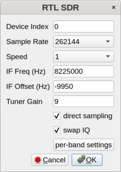

<a name="top"></a>
## So2sdr-bandmap Help Version 2.6.7

* [Controls](#controls)
* [So2sdr-bandmap setup](#bandmap_setup)
* [TCP interface details](#tcp)
* [Issues](#issues)
* [Changes](#changes)

---

So2sdr-bandmap provides a "visual bandmap" that shows the activity on
the band for nearby frequencies. To use it you will need a SDR
receiver connected to the IF of your contesting radio. With this type
of setup, the SDR front end is automatically protected from
transmitted RF and gains the benefit of the main radio's front end
tuned circuits. There is also no need to tune the SDR frequency as the
radio is tuned; the SDR stays tuned at the IF frequency of the host
radio.

So2sdr-bandmap has been tested with the following SDR hardware:

* Softrock SDR receiver
* LP-PAN
* Afedri SDR, interfaced both via USB as a sound card, and via
ethernet.
* RTL-sdr (Nooelec v5 tested)

Other SDR's may work if they supply an I/Q stream over the sound card
interface or via ethernet with the SDR-IP protocol. The program has
been tested most with the Elecraft K3.

The program operates in two main modes, IF or RF based. In the IF
mode, the SDR is fed from the IF of the main radio. In this case, the
frequency the SDR is tuned to is fixed and normally equal or close to
the IF frequency of the radio.  The frequency the radio is tuned to
will be centered in the panadapter display and not move (you can
however drag the frequency ruler with the mouse to move the center).
Advantages of this setup are that the SDR is completely protected from
transmitted rf, and no retuning is required so very simple
crystal-controlled SDRs (like the Softrock) can be used.  In the RF
based mode, the SDR is connected to an antenna directly. Many radios
will have receive-level ports where the SDR can be attached, where it
will be protected during transmit. Some kind of receive splitter is
still needed however.  In the RF mode the SDR needs to be tuned, and
the red mark indicating the frequency the radio is tuned to will move.
For the RF mode, there are two submodes, manual and automatic. In the
manual mode, the logging program must send commands to recenter the
display (if the radio is tuned off the display, the red mark will
not appear). In the automatic mode, so2sdr-bandmap will automatically
retune the SDR whenever the radio frequency approaches the end of
the display in order to keep the red mark visible.

**Important for SO2R:** For SO2R usage, you need to provide two
different configurations for so2sdr-bandmap, with different bandmap ID
numbers (see below).  Test each radio's bandmap separately, and then
copy the .ini file so2sdr-bandmap.ini to a separate copy for that
bandmap, such as so2sdr-bandmap1.ini and so2sdr-bandmap2.ini.  So2sdr
has a setting to use different so2sdr-bandmap.ini files for each
radio.  You can also make a separate desktop shortcut to start the
bandmap for each radio, and so2sdr will detect when each has been
started.

[Return to top](#top)

---
<a name="controls"></a>
### Bandmap controls


Controls from left to right:

* start button
* stop button
* setup button
* quit buton
* Mark signals: if checked, so2sdr-bandmap will peak-detect signals,
placing a dot by each detected signal. This can be used to automatically
tune the radio to the next signal or find the largest open space
between signals.
* Gain slider: this controls the gain of the peak-detect algorithm.
Typically it does not need to be adjusted often, although sometimes
with heavy QRN you may want to decrease the gain. Moving the slider
to the right makes the algorithm #less# sensitive (like a
squelch control).
* Help menu

Other controls:

* Mouse:
    + Left clicking on the bandmap signals will tune the radio to
    this frequency.
	+ In the frequency scale: holding down the left mouse button and
    drag to  move
	 the center marker.
    + Right click brings up several options: an option to hide the
	upper toolbar; zoom (scale) setting; call delete function (if
	near a callsign); and IQ balance status dialog.

[Return to top](#top)

---

<a name="bandmap_setup"></a>
### Setting up So2sdr-bandmap

When the program starts, click the "wrench" icon. The main setup dialog opens:


* Bandmap ID number corresponds to the radio number in so2sdr; 1 or 2.
* TCP port: this is the TCP port number used to control the bandmap. If running SO2R,
each needs a different port number.
* UDP broadcast port: So2sdr-bandmap sends broadcast messages to this UDP port
after mouse clicks and other evens. Two copies of the program can share the same UDP port.
* N1MM+ : if this option is selected, So2sdr-bandmap will listen for UDP broadcasts
from N1MM+ logger and use them to set the center frequency. Fill in the port number
below.
* SDR type: the type of SDR receiver. Click configure for further details.
* CQ Finder time (in seconds): the length of time the program waits to determine if
a frequency is "empty."  This should be set to roughly the length of a typical
qso in the contest being operated. With longer exchanges (like in the
ARRL Sweepstakes) a longer time should be used here. Typically you should use a
value less than 30 seconds.
* CQ Finder use calls: if selected, spotted calls will also be used (in addition to
detected signals) to determine what frequencies for the CQ finder.
* Scroll right: reverses the scroll direction. Some people like this for one bandmap if two bandmaps
are placed on either side of the logging window.

#### Soundcard SDR setup


* Device: So2sdr-bandmap tries to test which available sound devices
will work with the program, and puts a checkmark next to these. This
check is not 100% effective however. Normally you want to use the line
input.
* Speed: controls the scroll speed of the bandmap.
* Sample Rate: for sound cards, 48, 96, and 192 KHz are supported.
* Bits: most sound cards support 24 bit sampling; very few will
support 32 bits.
* IF offset: this must be adjusted so that signals when zero beat
on the receiver appear centered on the red line (center of bandmap).
* Swap IQ: reverse I and Q channels. Try this if the spectrum is
inverted.
* IQ Correction: corrects for imbalance in the I and Q channels.
If I and Q are imbalanced, image signals will be present on the
display.
* Collect IQ correction data: so2sdr-bandmap will use strong signals
to measure and correct IQ balance. This only applies to soundcard
based SDRs.

Setup hints:

* On some linux systems so2sdr-bandmap may not be able to open
the sound card. A workaround is to use #pasuspender# to suspend
pulseaudio:

        pasuspender -- so2sdr-bandmap


#### SDR-IP (Network) SDR

This is a generic interface for network-based SDR's using the
SDR-IP protocol.


#### RTL-SDR SDR

This supports rtl-sdr devices using the librtl-sdr library.



* Device index: this is normally 0 (zero) if only one rtl-sdr device
is present. Several devices can be supported with different device indices.

* Sample rate: currently two rates are available: 262144 Hz, and 128000 Hz.
128000 Hz actually runs the rtl-sdr at 16 times this frequency, or 2040000 Hz.
16 samples are averaged together in this case, which helps to improve the
signal to noise ratio.

* Direct sampling: this is a special feature of some rtl-sdr devices that
allows covering HF (below 24 MHz).

#### Afedri Net SDR

This is an interface for the Afedri SDR using the network
interface. Note that it can also be used via the Soundcard
interface.


1. For single-receiver Afedri SDR: fill in IP address, TCP
and UDP ports. Set Multichannel to "Single", Channel to 1,
and fill in Freq. 1. Make sure that Broadcast is set to off.
In my testing, "swap IQ" needed to be checked. Note that
not all sample rates are supported by the Afedri hardware
(check documentation). If a sample rate is entered that is
not supported, the SDR will use the nearest available sample
rate, which will cause frequency inaccuracies in the bandmap
display.

2. Multi-channel Afedri SDR: so2sdr-bandmap also supports the
multi-channel Afedri SDR's. In this mode, a single unit can be used to
provide bandmaps for two radios. The broadcast option of the Afedri is
set so that two copies of so2sdr-bandmap can receive the SDR data.
One copy of so2sdr-bandmap should run as "Master" and one as "Slave".
The Master bandmap controls the frequency for both SDR receivers.
Start the Master bandmap first followed by the Slave.

    This mode is somewhat experimental. Sometimes the 2nd SDR receiver
    does not start; a workaround seems to be to stop the Master
    bandmap (square "stop" button) and then restart it again.

[Return to top](#top)

---

<a name="tcp"></a>

### TCP interface

So2sdr-bandmap uses TCP/UDP as the most portable and flexible option.
So2sdr-bandmap accepts commands via TCP using a very simple
protocol. Commands are sent to so2sdr-bandmap as a string of bytes
(little-endian for multiple byte data):

byte 1  : command

byte 2  : length in bytes (up to 255) of following data packet. 
            minimum length is 0 if no data follows.

following bytes: data (optional), format depends on command


#### General commands


+ Set Center Frequency: 'f' 0x66 dec 102
  followed by ascii characters giving frequency in Hz

+ Set SDR center Frequency: 'f' 0x68 dec 104
  followed by ascii characters giving frequency in Hz

+ Exit program: 'q' 0x71 dec 113
  No data follows (length=0). Using this command before terminating
  the  bandmap process allows the bandmap to shut down properly and
   update its config files.

+ Set TX state: 't' 0x74 dec 116
  No data follows (length=0). If transmit state is set, the bandmap will stop   peak detecting signals and display the red "TX" icon.

+ Set RX state: 'r' 0x72 dec 114 Cancels transmit state (see 0x74)

+ Find open frequency: 'g' 0x67 dec 103 Finds an open frequency on the bandmap. This will only function after the center frequency has been set. The found frequency will be returned via UDP (see below).

+ Set freq finder lower limit: 'l' 0x6C dec 108
    Set lower limit frequency for "Find open freq"
    followed by ascii characters giving frequency in Hz

+ Set freq finder upper limit: 'u' 0x75 dec 117
    Set upper limit frequency for "Find open freq"
    followed by ascii characters giving frequency in Hz

+ Set bandmap offset: 'o' 0x6f dec 111
   Set offset in Hz between frequency displayed and actual center freq.
   Followed by ascii characters giving offset in Hz.

+ Set bandmap invert: 'i'  0x69 dec 105
   If turned on, spectrum will be inverted. Useful for CW-reverse mode
   and some radios that have inverted IF on certain bands.
   Followed by single byte- if 0x00, sets invert off, any other byte
   sets invert on.

+ Qsy to next higher signal:  'U' 0x55 dec 85
   Length zero. Qsy's to next higher marked signal (black dot) on band. The new frequency is returned to the controlling program via UDP.

+ Qsy to next lower signal:  'D' 0x44 dec 68
   Length zero. Qsy's to next lower marked signal (black dot) on band. The new frequency  is returned to the controlling program via UDP.


#### Call marking

So2sdr-bandmap can display callsigns and optionally highlight the
actual CW signal of a station with a specific color. The program
stores a list of callsigns and frequencies that are currently being
displayed.  TCP commands are used to manage this list. The program is
not designed to intelligently manage this list (for example finding
dupes or removing calls after a set time), this is left up to the
managing TCP connection.

1. Add callsign: 'a' 0x61 dec 97
 followed by
   * command string length byte
   * command string:

        callsign,frequency,R1G1B1R2G2B2flag

        + callsign = ASCII callsign data
        + frequency = frequency in Hz
        + R1 = byte giving red color value (0:255) for call
        + G1 = byte giving green color value (0:255) for call
        + B1 = byte giving blue color value (0:255) for call
        + R2 = byte giving red color byte for signal: 0 or 1
        + G2 = byte giving green color byte for signal: 0 or 1
        + B2 = byte giving blue color byte for signal: 0 or 1
        + flag = 0x00 means no highlight, any other value means highlight

 example: puts N4OGW on bandmap at 14035100 Hz, callsign in magenta
and signal higlighted in magenta:
 
```
    0x61 0x16 N4OGW,14035100,0xff 0x00 0xff 0x01 0x00 0x01 1
```

2. Delete callsign: 'd'  0x64 dec 100
  followed by
    - length byte
    - callsign

3. Delete call at a specific frequency: 'e' 0x65 dec 101
    followed by ascii characters giving a frequency in Hz

	Deletes all calls that are  within SIG\_MIN\_FREQ\_DIFF (set in defines.h, 65 Hz) of the given frequency

4. Clear all calls: 'x' 0x78 dec 120
   command length 0


#### UDP broadcasts


So2sdr-bandmap sends out UDP packets in response to several types
of events:

* clicking on the bandmap or a marked signal. The UDP packet contains
the new frequency:

        <?xml version="1.0" encoding="UTF-8"?>
        <So2sdr>
        <bandmap RadioNr="1" freq="14037726"/>
        </So2sdr>

RadioNr is the bandmap ID number. A similar packet is broadcast in
response to a request to find an open frequency. Note that the frequency
is given in Hz.


* deleting a call with the mouse. The right-click menu gives the option
to delete a call. The bandmap itself does not delete the call from its
list, this should be done by the controlling program in response to
the UDP packet.

        <?xml version="1.0" encoding="UTF-8"?>
        <So2sdr>
        <bandmap RadioNr="1" freq="14022977" call="N4OGW" operation="delete"/>
        </So2sdr>


[Return to top](#top)

---

<a name="issues"></a>

## Known issues

* Linux: soundcard SDR's may not start on certain systems with an
error "Audio device does not support stereo." A workaround is to use
the pasuspender utility to stop Pulseaudio. If starting the bandmap
from so2sdr, do this

            pasuspender -- so2sdr
   
    or if running so2sdr-bandmap separately,

            pasuspender -- so2sdr-bandmap

[Return to top](#top)

---

<a name="changes"></a>

## version 2.6.7 (03/12/2023)

* Fix bug with deleting calls with right mouse click. Wrong call
was being sent.

## version 2.6.6 (01/20/2023)

* Afedri: wait for acknowledgement after each tcp command. This should
help prevent commands being sent too fast to the sdr.

## version 2.6.5 (01/17/2023)

* Add indicator showing number of tcp clients connected (two maximum)
* New method of tuning SDR in RF/RFauto modes for Afedri dual receiver
sdr. One bandmap is set up as master and controls the sdr parameters.
The other bandmap is set up as slave. The slave
now connects to the tcp server of the master bandmap and passes frequency
changes to the master bandmap.
* Do not retune SDR in RFauto mode when dragging frequency scale with mouse
* Fix bug where bandmap would only start on second click


## version 2.6.4 (01/10/2023)

* Add option to stop bandmap during transmit
* Improve recentering of display in RFauto mode
* Fix dual channel Afedri in RF/RFauto modes

## version 2.6.3 (01/01/2023)

* fix signal highlighting in RF/autocenter mode

## version 2.6.2 (12/25/2022)

* add options for IF versus RF panadapters
* reformat .h and .cpp files with clang-format

## version 2.6.1

* various bug fixes. Fix ARRL 10m contest indication of which band the radio is on

## version 2.6.0 (12/03/2022)

* initial support for RTL-sdr sdr's. librtl-sdr is now needed to compile so2sdr-bandmap.
To be used for HF, the device (and librtl-sdr) needs to support "direct sampling." Not
all rtl-sdr devices are capable of this. Two modes are available: direct (x1) and
x16 oversampled. The x16 improves the SNR slightly.

## version 2.5.17 (11/17/2022)

* remove dependency on qtx11extras
* so2sdr-bandmap bug fix: when running without standalone (without so2sdr attached), swap iq and offset were ignored because band wasn't being set.

## version 2.5.16 (11/13/2022)

* fix bug preventing rigctld from working

## version 2.5.15 (08/12/2022)

* improvements to script capability in message macros (see Help)

## version 2.5.14 (01/10/2022)

* add support for CWDdaemon

## version 2.5.13 (10/30/2021)

* fix voice recording/playback

## version 2.5.12 (08/06/2021)

* updates for depreciated Qt features
* changes to code that reads radio IF offset; now should read from any
radio that hamlib can read IF offset

## version 2.5.10 (01/04/2021)

* Fix bug with saving bandmap settings

## version 2.5.9 (11/23/2020)

* Fix bug in call/exchange entry in Sweepstakes; if call edited after exchange accepted, qso would not log
* Code changes for depreciated Qt features
* macro SCRIPT now reads script from user directory (/home/username/.so2sdr/scripts)

## version 2.5.8 (11/06/2020)

* Add PE as mult in ARRL Sweepstakes and other ARRL contests

## version 2.5.7 (08/29/2020)

* Add WW Digi contest

## version 2.5.6 (08/08/2020)

* Make cursor visible in two keyboard mode
* Correct Sprint behavior in two keyboard mode
* Fix behavior of 2KBD macro. Required adding a slight delay when this macro is triggered
* add status bar message when starting/stopping two keyboard mode
* Starting two keyboard mode now disables Grab mode- the two keyboard handler automatically grabs the keyboard

## version 2.5.5 (07/31/2020)

* change how entry of zones is handled in RST+zone contests. Now can update zone by simply typing a space and the new zone. In some cases (SSB mode) this will no longer recognize a non-standard RST/RS. Non-standard signal reports can be entered in this case after logging the qso using the edit function.

* fix bug with bandmap dupe marking ("*" call and -/= keys). All dupe marks were being  deleted at once.

## version 2.5.4 (06/20/2020)

* fix bugs with WSJTX interface; add dislay of sequence information. Double clicking on a call now sets the correct sequence
* fix dupe status of rovers in June VHF contest logged from WSJTX

## version 2.5.3 (06/11/2020)

* change in log file format. Logs from older version cannot be opened, must be imported from Cabrillo
* add new WSJTX window showing decoded calls and dupe/mult status. This is only fully functional for ARRL June VHF contest
* many code cleanups and small bug fixes

## version 2.5.2 (04/28/2020)

* fix dupe checking in multi-mode contests
* fix cabrillo import
* allow changing mode when editing qso

## version 2.5.1 (11/23/2019)

* minor fixes to UI and fonts

## version 2.5.0 (09/14/2019)

* add two keyboard support
* update help file

## version 2.4.8 (06/05/2019)

* fix bugs with echo of winkey sending
* fix some typos in help file

## version 2.4.7 (04/07/2019)

* fix bug in multimode contests. Second mode qsos were showing as dupes
* fix multiplier bug in CQP

## version 2.4.6 (11/10/2018)

* add 630M and 2200M bands
* fix crashes when not on a contest band
* fix bug with window layout changing when call entered
* fix bug could not delete call/freq moved
* fix bug calls on bandmap not removed if band had changed


## version 2.4.5 (08/10/2018)

* improve appeareance on high-DPI displays
* fix bug with dupesheet in Sprint

## version 2.4.4 (07/11/2018)

* update IARU HQ mults
* fix display of frequency when editing qso with ctrl-e

## version 2.4.3 (07/03/2018)

bug fixes:

* fix core dump if no network connection for CTY download
* fix x2 zoom in bandmap
* make bandmap offset/swap IQ consistent between main setting and per-band
* prevent some writes to network SDR when port closed
* fix qsy by clicking on bandmap on 144 MHz (was only qsying to nearest KHz)
* correct freq format in cabrillo output for VHF contests; only give band
* clicking on entry window changes RX and TX. This fixes bug where entering a frequency immediately after program start also changed the radio
* Fix error in contest.cpp where uninitialized score object might be accessed.
* Fix error in mobile dupe checking.


## version 2.4.2 (06/09/2018)

* frequency not sent correctly to bandmap; caused bandmap freq to only update every KHz

## version 2.4.1 (06/09/2018)

* bug fixes: program was crashing when tuned out of band
* fix freq labels in bandmap
* start up with serial port RTS/DTR PTT signal off

## version 2.4.0 (06/08/2018)

* support for the ARRL June VHF contest
* support for reading ADIF qso information via UDP from WSJT-X
* allow per-band setting of IF offset and inversion (same as swap IQ) in so2sdr-bandmap
* To support higher frequency bands, the  internal format for frequency stored in log was changed.

## version 2.3.5 (04/14/2018)

* bug fix: store auto-CQ time as integer to prevent roundoff issues
* new feature: automatically download CTY files. 
* wl_cty.dat is now read from ~/.so2sdr

## version 2.3.4 (04/14/2018)

* bug fix: update score after onscreen log edit
* update to phone macros in all cfg files

## version 2.3.3 (04/07/2018)

* bug fix MS qso party cfg file
* remove check on changed freq when qsying bandmap; fails in some cases

## version 2.3.2 (04/05/2018)

* support Mississippi qso party

## version 2.3.1 (02/18/2018)

* fix bug: peak detection not turned of during transmit

## version 2.3.0 (02/18/2018)

* many internal changes and reorganization of code
* better support for multi-mode contests
* improve bandmap peak detection: when radio is tuned, momentarily turn off peak detection

## version 2.2.0 (11/19/2017)

* rewrite and simplification of the audio play and record features.  See the section
in the help file on voice messages.

## version 2.1.5 (10/21/2017)

* update SCP and CTY files
* fix winkey bug- changing parameters now works without restart

## version 2.1.4 (05/31/2017)

* Bug fixes for WPX contest
* Update help file
* Other bug fixes: fix fonts in some dialogs, make multipliers window scrollable

## version 2.1.3 (01/10/2017)

* Update multipliers for NAQP and Sprint contests

## version 2.1.2 (12/30/2016)

* Several fixes/enhancements from NO3M:

* Several AutoCQ bugs, esp in conjunction w/ Alt-D;
AutoCQ calls sendFunc() instead of enter();
Fix autoCQ related switchTransmit calls in expandMacro function

* Alt+Space to start Alt-D QSO at any time, including during active CQ
QSO; space still works the same when focused in CQ call field.

* Alt+ESC to wipe focused field without killing CW

* Sometimes call or exchange field data would be selected when
re-focused.  Added deselect() to several places

* CW speed under certain radio switching conditions (ie. cntrl-R) would
not reflect current active radio speed.  Added conditional statements at
the top of expandMacro to set tmp_wpm variable.

* Prevent literal spacebar processing when using Alt-space keypress to
start Alt-D QSO during CQ QSO

* Silently switch radios with Alt-D esc in case alt-esc (silent) keypress
is used


## version 2.1.1 (12/05/2016)

* wav directory sometimes created in wrong place

## version 2.1.0 (12/02/2016)

* Add support for voice recording.  See new section in help.

* So2sdr-bandmap: add option to also ignore spotted calls when searching for open cq frequencies.

* NO3M: activeRadio is temporarily set to autoCQRadio in enter when
AutoCQ is active and unpaused to prevent exchange being sent on CQ
radio if a call is present in AltD radio field.

* NO3M: AltD QSO is logged without interrupting CW on CQ radio.


## version 2.0.11 (11/08/2016)

* Bug fix: editing call or report broken in Qt5 (cursor jumps to end of line)

* Fix log headings for Sweepstakes

* clean up in serial code

## version 2.0.10 (10/26/2016)

* Another fix for winkey status getting stuck in TX

## version 2.0.9 (10/22/2016)

* Add support for radio control via hamlib rigctld

* Bug fix for auto cq and alt-D qsos

* shorten some delays in winkey initialization


## version 2.0.8 (10/06/2016)

* Bug fix for Qt5- SQL changes broke dupe checking

* Activating AutoCQ or dueling CQ will not interrupt current CW/msg
    transmission.  Dueling will start on focused radio if no CW, otherwise
    focuses other radio ready for toggling sequence. (NO3M)

## version 2.0.7 (10/04/2016)

* fixes to Winkey initialization (NO3M)

* fixes for Qt 5 sqlite

* Initialize activeTxRadio to -1 so switchTransmit is forced to
update SO2R device on startup (NO3M)

* Set QSO invalid if clearing Exchange line with ESC; wiping prefill
would allow QSO to be logged with no text in Exchange line (NO3M)

* When dupe allowed (no checking or WORK DUPES), focus exchange field
after sending CQ exchange (NO3M)

* Revert change made in 2013; block Alt-D during Sprint (NO3M)

* Remove {CALL_ENTERED} from Dupe MSG when using Autosend to avoid
sending call twice (NO3M)

* AutoCQ disables Dueling CQ and Toggle ESM (NO3M)

* Dueling CQ or Toggle ESM disables AutoCQ (NO3M)

* TAB (S&P) on AutoCQRadio or SWAP radios (macro) kills AutoCQ,
Dueling CQ, Toggle ESM (NO3M)

* Send F1 (long CQ) immediately when AutoCQ or Dueling CQ first
enabled unless QSO in progress, then start in SLEEP mode (NO3M)

* Disable AutoCQ and Dueling CQ in sprint mode (NO3M)


* AutoCQ:
Several bugs fixes, including with Alt-D interaction and timing/debounce
Pressing F1/F2 while un-paused sets long/short CQ silently (same as before)
Pressing F3-F12, ESC, or entering text in callsign field pauses
F1/F2, ENTER, or logging QSO un-pauses (NO3M)

* Dueling CQ: Re-implemented with better control and sleep (pause)
mode CQ starts on focused radio Pressing F1/F2 while un-paused sets
long/short CQ silently Pressing F3-F12, ESC, or ALT-R / CTRL-R, or
entering text in either call field pauses F1/F2, ENTER, or logging QSO
un-pauses if both call fields empty When paused (SLEEP), goes into
Toggle ESM, notes below (NO3M)

*Toggle ESM / Dueling CQ (SLEEP): Numerous bug fixes and cleaner
implementation, much better and more flexible than previously
Re-implemented; toggleEnter() function removed.  Uses regular ESM
enter() function now Focused radio behavior same as normal non-toggle
operation.  ESM processed by enter(). ESM, Fx, "\" keypresses start CW
immediately on focused radio and shift focus to opposite radio Works
with CTRL-ENTER and SHIFT-ENTER. Backslash "\" doesn't toggle ready
for next quick station ALT-R or CTRL-R allowed to manually toggle
focus, next CW message (ESM, Fx, etc) goes out on focused radio and
toggling resumes Can use empty Fx message to toggle w/o sending CW to
maintain QSO flow control / timing or use ALT/CTRL-R as noted above (NO3M)

## version 2.0.6 (02/02/2016)

* internal changes to dupesheet

* sunrise/sunset was displayed incorrectly for some calls in wl_cty.dat

* fix build for Qt 4 and Qt 5. To rebuild and switch Qt versions, you
must run "make distclean". The version of qmake used selects the version
of Qt.

* Another change to try to keep the TX status of the bandmap in sync

* Bug fix: under certain conditions, when logging a qso with ctrl-Enter, the
  sent qso number was logged as zero.

## version 2.0.5

* Bug fix: telnet spots were not working

* Add support for PA QSO Party. Some issues however:

    1. the one DX mult for PA stations is not counted
    2. county line operations have to be worked as two separate
    qsos, which will however double-count qso points
    3. portable (/P) and rover (/R) calls are not able to
	change counties. Only mobile /M can change counties.

* Bug fix: geometry of bandmap windows was not being saved when
closing them from within so2sdr.

* Update default config file for CA QSO Party (out of state). Was
missing state in exchange.


## version 2.0.4

* Bug fix: when cancelling CW (for example when switch radios), the
"TX" indicator on the bandmap should be turned off.

* Bug fix for autosend: if CNTRL-R is pressed before the callsign is
 done being sent in Autosend mode, the CW pauses for as long as focus
 is on the other radio, and then starts sending the callsign from the
 begnning if CNTRL-R back to the original radio. (NO3M)

* If already in a S/P QSO, call and exch fields populated, keyboard focus on
 exchange field, but QSY before logging.  QSO is wiped but Sprint space no
 longer works, required hitting ESC to restore. Added extra cleanups to 'qso'
 object, et.al., and set focus to call field when QSYing. (NO3M)

* When QSYing active radio before a QSO was logged, and active radio was
 also the active TX radio (last to transmit),  activeR2CQ was set to false
 but inactive radio callsign field remained "CQCQCQ"/colorized.  Fixed
 activeR2CQ check during QSY to always match inactive radio as QSYing radio
 before clearing R2CQ status. R2CQ radio should always be inactive since
 making that radio active requires [CNTRL/ALT]-R or mouse click focus, which
 all clear R2CQ status. (NO3M)

* add option to scroll to the right in so2sdr-bandmap (NO3M)

* check for a standard contest config file in the user directory
(i.e. ~/.sosdr) when starting a new contest. If this file exists,
it will be used instead of the program default from share/so2sdr (NO3M)

## version 2.0.3

* remove line leftover from testing preventing callsign clearing on radio 2

## version 2.0.2

* fix some bugs related to setting the config file for so2sdr-bandmap,
and choosing the executable for the bandmap in so2sdr.
* hopefully fix some bugs related to S&P mode


## version 2.0.1

* update help files in so2sdr and so2sdr-bandmap

## version 2.0.0

* add network interface SDRs and Afedri SDR
* some unfinished features removed for the moment (click filter and
  DVK setup)
* rewrite of SDR bandmap; it is now a separate executable and can
  be used with other programs (see Documentation for use with 
  N1MM).
* known problems:
    + control of Afedri SDRs is somewhat buggy for dual-receiver
    models (when using both receivers).

    + under some Linux distributions  so2sdr-bandmap may have trouble 
    accessing the sound card if Pulseaudio is in use. A workaround is to
    use the pasuspender utility to stop Pulseaudio while so2sdr is
    running. If starting the bandmap from so2sdr, do this

            pasuspender -- so2sdr
   
        or if running so2sdr-bandmap separately,

            pasuspender -- so2sdr-bandmap


[Return to top](#top)
