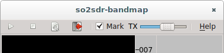
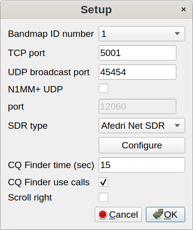
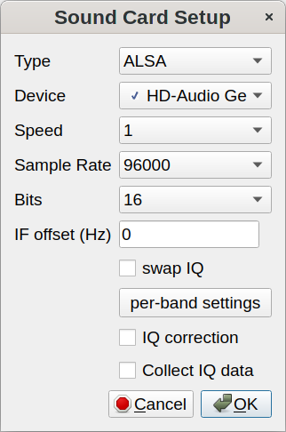
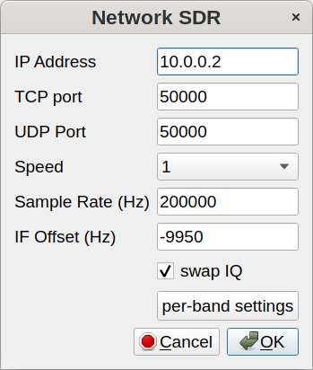

<a name="top"></a>
## So2sdr-bandmap Help Version 2.0.2

* [Controls](#controls)
* [So2sdr-bandmap setup](#bandmap_setup)
* [TCP interface details](#tcp)
* [Issues](#issues)
* [Changes](#changes)

---

So2sdr-bandmap provides a "visual bandmap" that shows the activity on
the band for nearby frequencies. To use it you will need a SDR
receiver connected to the IF of your contesting radio. With this type
of setup, the SDR front end is automatically protected from
transmitted RF and gains the benefit of the main radio's front end
tuned circuits. There is also no need to tune the SDR frequency as the
radio is tuned; the SDR stays tuned at the IF frequency of the host
radio.

So2sdr-bandmap has been tested with the following SDR hardware:

* Softrock SDR receiver
* LP-PAN
* Afedri SDR, interfaced both via USB as a sound card, and via
ethernet.

Other SDR's may work if they supply an I/Q stream over the sound card interface
or via ethernet with the SDR-IP protocol. The program has been tested most with the
Elecraft K3.

**Important for SO2R:** For SO2R usage, you need to provide two
different configurations for so2sdr-bandmap, with different bandmap ID
numbers (see below).  Test each radio's bandmap separately, and then
copy the .ini file so2sdr-bandmap.ini to a separate copy for that
bandmap, such as so2sdr-bandmap1.ini and so2sdr-bandmap2.ini.  So2sdr
has a setting to use different so2sdr-bandmap.ini files for each
radio.  You can also make a separate desktop shortcut to start the
bandmap for each radio, and so2sdr will detect when each has been
started.

[Return to top](#top)

---
<a name="controls"></a>
### Bandmap controls




Controls from left to right:

* start button
* stop button
* setup button
* quit buton
* Mark signals: if checked, so2sdr-bandmap will peak-detect signals,
placing a dot by each detected signal. This can be used to automatically
tune the radio to the next signal or find the largest open space
between signals.
* Gain slider: this controls the gain of the peak-detect algorithm.
Typically it does not need to be adjusted often, although sometimes
with heavy QRN you may want to decrease the gain. Moving the slider
to the right makes the algorithm #less# sensitive (like a
squelch control).
* Help menu

Other controls:

* Mouse:
    + Left clicking on the bandmap signals will tune the radio to
    this frequency.
	+ In the frequency scale: holding down the left mouse button and
    drag to  move
	 the center marker.
    + Right click brings up several options: an option to hide the
	upper toolbar; zoom (scale) setting; call delete function (if
	near a callsign); and IQ balance status dialog.

[Return to top](#top)

---

<a name="bandmap_setup"></a>
### Setting up So2sdr-bandmap

When the program starts, click the "wrench" icon. The main setup dialog opens:



* Bandmap ID number corresponds to the radio number in so2sdr; 1 or 2.
* TCP port: this is the TCP port number used to control the bandmap. If running SO2R,
each needs a different port number.
* UDP broadcast port: So2sdr-bandmap sends broadcast messages to this UDP port
after mouse clicks and other evens. Two copies of the program can share the same UDP port.
* N1MM+ : if this option is selected, So2sdr-bandmap will listen for UDP broadcasts
from N1MM+ logger and use them to set the center frequency. Fill in the port number
below.
* SDR type: the type of SDR receiver. Click configure for further details.
* CQ Finder time (in seconds): the length of time the program waits to determine if
a frequency is "empty."  This should be set to roughly the length of a typical
qso in the contest being operated. With longer exchanges (like in the
ARRL Sweepstakes) a longer time should be used here. Typically you should use a
value less than 30 seconds.

#### Soundcard SDR setup



* Type: for Linux there is only one option, ALSA. In Windows there are several
different sound API's.
* Device: So2sdr-bandmap tries to test which available sound devices
will work with the program, and puts a checkmark next to these. This
check is not 100% effective however. Normally you want to use the line
input.
* Speed: controls the scroll speed of the bandmap.
* Sample Rate: for sound cards, 48, 96, and 192 KHz are supported.
* Bits: most sound cards support 24 bit sampling; very few will
support 32 bits.
* IF offset: this must be adjusted so that signals when zero beat
on the receiver appear centered on the red line (center of bandmap).
* Swap IQ: reverse I and Q channels. Try this if the spectrum is
inverted.
* IQ Correction: corrects for imbalance in the I and Q channels.
If I and Q are imbalanced, image signals will be present on the
display.
* Collect IQ correction data: so2sdr-bandmap will use strong signals
to measure and correct IQ balance.

Setup hints:

* On some linux systems so2sdr-bandmap may not be able to open
the sound card. A workaround is to use #pasuspender# to suspend
pulseaudio:

        pasuspender -- so2sdr-bandmap

* Windows: the audio API used by so2sdr-bandmap, portaudio,
provides several Windows sound API's. Some may provide better
performance than others.

#### SDR-IP (Network) SDR

This is a generic interface for network-based SDR's using the
SDR-IP protocol.



#### Afedri Net SDR

This is an interface for the Afedri SDR using the network
interface. Note that it can also be used via the Soundcard
interface.


1. For single-receiver Afedri SDR: fill in IP address, TCP
and UDP ports. Set Multichannel to "Single", Channel to 1,
and fill in Freq. 1. Make sure that Broadcast is set to off.
In my testing, "swap IQ" needed to be checked. Note that
not all sample rates are supported by the Afedri hardware
(check documentation). If a sample rate is entered that is
not supported, the SDR will use the nearest available sample
rate, which will cause frequency inaccuracies in the bandmap
display.

2. Multi-channel Afedri SDR: so2sdr-bandmap also supports the
multi-channel Afedri SDR's. In this mode, a single unit can be used to
provide bandmaps for two radios. The broadcast option of the Afedri is
set so that two copies of so2sdr-bandmap can receive the SDR data.
One copy of so2sdr-bandmap should run as "Master" and one as "Slave".
The Master bandmap controls the frequency for both SDR receivers.
Start the Master bandmap first followed by the Slave.

    This mode is somewhat experimental. Sometimes the 2nd SDR receiver
    does not start; a workaround seems to be to stop the Master
    bandmap (square "stop" button) and then restart it again.

[Return to top](#top)

---

<a name="tcp"></a>

### TCP interface

So2sdr-bandmap uses TCP/UDP as the most portable and flexible option.
So2sdr-bandmap accepts commands via TCP using a very simple
protocol. Commands are sent to so2sdr-bandmap as a string of bytes
(little-endian for multiple byte data):

byte 1  : command

byte 2  : length in bytes (up to 255) of following data packet. 
            minimum length is 0 if no data follows.

following bytes: data (optional), format depends on command


#### General commands


+ Set Center Frequency: 'f' 0x66 dec 102
  followed by ascii characters giving frequency in Hz

+ Exit program: 'q' 0x71 dec 113
  No data follows (length=0). Using this command before terminating
  the  bandmap process allows the bandmap to shut down properly and
   update its config files.

+ Set TX state: 't' 0x74 dec 116
  No data follows (length=0). If transmit state is set, the bandmap will stop   peak detecting signals and display the red "TX" icon.

+ Set RX state: 'r' 0x72 dec 114 Cancels transmit state (see 0x74)

+ Find open frequency: 'g' 0x67 dec 103 Finds an open frequency on the bandmap. This will only function after the center frequency has been set. The found frequency will be returned via UDP (see below).

+ Set freq finder lower limit: 'l' 0x6C dec 108
    Set lower limit frequency for "Find open freq"
    followed by ascii characters giving frequency in Hz

+ Set freq finder upper limit: 'u' 0x75 dec 117
    Set upper limit frequency for "Find open freq"
    followed by ascii characters giving frequency in Hz

+ Set bandmap offset: 'o' 0x6f dec 111
   Set offset in Hz between frequency displayed and actual center freq.
   Followed by ascii characters giving offset in Hz.

+ Set bandmap invert: 'i'  0x69 dec 105
   If turned on, spectrum will be inverted. Useful for CW-reverse mode
   and some radios that have inverted IF on certain bands.
   Followed by single byte- if 0x00, sets invert off, any other byte
   sets invert on.

+ Qsy to next higher signal:  'U' 0x55 dec 85
   Length zero. Qsy's to next higher marked signal (black dot) on band. The new frequency is returned to the controlling program via UDP.

+ Qsy to next lower signal:  'D' 0x44 dec 68
   Length zero. Qsy's to next lower marked signal (black dot) on band. The new frequency  is returned to the controlling program via UDP.


#### Call marking

So2sdr-bandmap can display callsigns and optionally highlight the
actual CW signal of a station with a specific color. The program
stores a list of callsigns and frequencies that are currently being
displayed.  TCP commands are used to manage this list. The program is
not designed to intelligently manage this list (for example finding
dupes or removing calls after a set time), this is left up to the
managing TCP connection.

1. Add callsign: 'a' 0x61 dec 97
 followed by
   * command string length byte
   * command string:

        callsign,frequency,R1G1B1R2G2B2flag

        + callsign = ASCII callsign data
        + frequency = frequency in Hz
        + R1 = byte giving red color value (0:255) for call
        + G1 = byte giving green color value (0:255) for call
        + B1 = byte giving blue color value (0:255) for call
        + R2 = byte giving red color byte for signal: 0 or 1
        + G2 = byte giving green color byte for signal: 0 or 1
        + B2 = byte giving blue color byte for signal: 0 or 1
        + flag = 0x00 means no highlight, any other value means highlight

 example: puts N4OGW on bandmap at 14035100 Hz, callsign in magenta
and signal higlighted in magenta:
 
```
    0x61 0x16 N4OGW,14035100,0xff 0x00 0xff 0x01 0x00 0x01 1
```

2. Delete callsign: 'd'  0x64 dec 100
  followed by
    - length byte
    - callsign

3. Clear all calls: 'x' 0x78 dec 120
   command length 0


#### UDP broadcasts


So2sdr-bandmap sends out UDP packets in response to several types
of events:

* clicking on the bandmap or a marked signal. The UDP packet contains
the new frequency:

        <?xml version="1.0" encoding="UTF-8"?>
        <So2sdr>
        <bandmap RadioNr="1" freq="14037726"/>
        </So2sdr>

RadioNr is the bandmap ID number. A similar packet is broadcast in
response to a request to find an open frequency. Note that the frequency
is given in Hz.


* deleting a call with the mouse. The right-click menu gives the option
to delete a call. The bandmap itself does not delete the call from its
list, this should be done by the controlling program in response to
the UDP packet.

        <?xml version="1.0" encoding="UTF-8"?>
        <So2sdr>
        <bandmap RadioNr="1" freq="14022977" call="N4OGW" operation="delete"/>
        </So2sdr>


[Return to top](#top)

---

<a name="issues"></a>

## Known issues

* Windows: the program may not run on Windows XP. In my testing, so2sdr ran
on one XP system but not another. So2sdr-bandmap ran on both systems. This
is related to differences in Microsoft DLL's which are not handled by
the mingw compiler.

* Linux: soundcard SDR's may not start on certain systems with an
error "Audio device does not support stereo." A workaround is to use
the pasuspender utility to stop Pulseaudio. If starting the bandmap
from so2sdr, do this

            pasuspender -- so2sdr
   
    or if running so2sdr-bandmap separately,

            pasuspender -- so2sdr-bandmap

[Return to top](#top)

---

<a name="changes"></a>

## version 2.0.2

* fix some bugs related to setting the config file for so2sdr-bandmap,
and choosing the executable for the bandmap in so2sdr.
* hopefully fix some bugs related to S&P mode


## version 2.0.1

* update help files in so2sdr and so2sdr-bandmap

## version 2.0.0

* add network interface SDRs and Afedri SDR
* some unfinished features removed for the moment (click filter and
  DVK setup)
* rewrite of SDR bandmap; it is now a separate executable and can
  be used with other programs (see Documentation for use with 
  N1MM).
* known problems:
    + control of Afedri SDRs is somewhat buggy for dual-receiver
    models (when using both receivers).

    + under some Linux distributions  so2sdr-bandmap may have trouble 
    accessing the sound card if Pulseaudio is in use. A workaround is to
    use the pasuspender utility to stop Pulseaudio while so2sdr is
    running. If starting the bandmap from so2sdr, do this

            pasuspender -- so2sdr
   
        or if running so2sdr-bandmap separately,

            pasuspender -- so2sdr-bandmap


[Return to top](#top)
